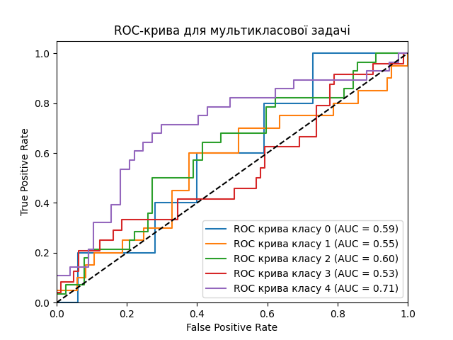
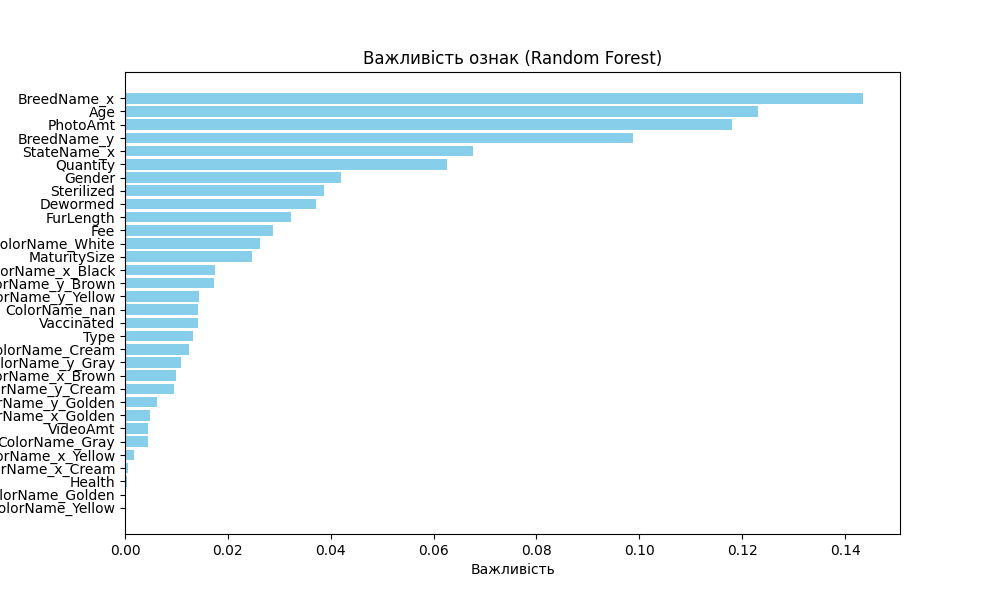

**[English](README.md)** | **[Українська](README.ua.md)**

# Передбачення Усиновлення Тварин 🐾

Проєкт машинного навчання для передбачення швидкості усиновлення тварин у притулках. Цей проєкт допомагає притулкам оптимізувати підхід до пошуку дому для тварин, передбачаючи ймовірність усиновлення на основі різних характеристик тварини.


## Зміст

- [Огляд](#огляд)
- [Особливості](#особливості)
- [Результати](#результати)
- [Вимоги](#вимоги)
- [Встановлення](#встановлення)
- [Використання](#використання)
- [Структура проєкту](#структура-проєкту)
- [Деталі моделі](#деталі-моделі)

## 🎯 Огляд

**Бізнес-потреба:** Best Friends Animal Society прагне підвищити ймовірність усиновлення тварин у притулках, мінімізуючи час, який тварини проводять у пошуку свого дому. Ця модель машинного навчання передбачає швидкість усиновлення на основі характеристик тварин, дозволяючи притулкам адаптувати підходи до догляду та маркетингові стратегії для максимального успіху усиновлення.

Модель використовує **RandomForestClassifier** з оптимізованими гіперпараметрами для передбачення швидкості усиновлення. Категорії AdoptionSpeed:

- **0** - Усиновлено в той же день (усиновлено одразу)
- **1** - Усиновлено в перший тиждень (впродовж 1 тижня)
- **2** - Усиновлено в перший місяць (впродовж 1 місяця)
- **3** - Усиновлено в перші 3 місяці (впродовж 3 місяців)
- **4** - Не усиновлено після 100 днів (після 100 днів)

## ✨ Особливості

- **Пайплайн попередньої обробки даних** з автоматичною інженерією ознак
- **Оптимізація гіперпараметрів** для максимальної продуктивності моделі
- **Обробка дисбалансу класів** за допомогою відповідних технік вибірки
- **Комплексні метрики оцінки** та візуалізації
- **Простий у використанні пайплайн** для навчання та передбачення

## 📊 Результати

### Продуктивність моделі

- **Точність:** 35% (макросереднє: 28%)
- **Найкраща продуктивність** на класі 4 (не усиновлено після 100 днів) з точністю 52% та повнотою 54%

### Візуалізації результатів

#### Матриця плутанини


- Матриця плутанини показує, як часто модель передбачає кожен клас для кожного реального класу.
- Значення на діагоналі матриці представляють правильні передбачення, а значення поза діагоналлю вказують на неправильні класифікації.
- Загалом, кількість правильних передбачень (значення на діагоналі матриці) є доволі низькою, що свідчить про потребу в покращенні якості моделі.

#### ROC-крива (багатокласова)



- ROC-крива (Receiver Operating Characteristic) оцінює здатність моделі розрізняти між різними класами швидкості усиновлення.
- Кожна крива представляє різний клас, а площа під кривою (AUC) вказує на продуктивність моделі для цього класу.
- Криві, ближчі до верхнього лівого кута, вказують на кращу продуктивність класифікації.
- Багатокласова ROC-крива допомагає візуалізувати компроміс між справжніми позитивними та хибними позитивними частотами для всіх класів.

#### Важливість ознак



- Ця візуалізація показує, які ознаки є найважливішими для передбачень моделі.
- Ознаки з вищими оцінками важливості мають більший вплив на передбачення швидкості усиновлення.
- Розуміння важливості ознак допомагає визначити, які характеристики тварин найбільше впливають на результати усиновлення.
- Ця інформація може допомогти притулкам зосередитися на найважливіших факторах при підготовці тварин до усиновлення.

#### Розподіл передбачень


- Ця гістограма показує частоту різних класів, передбачених моделлю.
- Клас 2 має найбільшу частоту передбачень, а клас 0 — найменшу.
- Такий дисбаланс може бути ознакою того, що модель не здатна добре передбачати певні класи, можливо через недостатню кількість даних для навчання в цих категоріях.
- Розподіл допомагає визначити потенційні зміщення в передбаченнях моделі.

#### Порівняльна гістограма


- Ця діаграма дозволяє побачити, як розподіляються реальні значення AdoptionSpeed у порівнянні з передбаченими значеннями моделі.
- Видно, що модель має схильність до зміщення результатів для деяких категорій, і певні класи переважають у передбаченнях.
- Це може свідчити про перекоси в навчальних даних або недостатню узагальненість моделі.
- Порівняння розподілів реальних та передбачених значень допомагає оцінити загальну продуктивність моделі та визначити області для покращення.

## 📦 Вимоги

- Python 3.7 або новіша версія
- numpy==1.24.3
- pandas==2.2.2
- scikit-learn==1.5.2
- imbalanced-learn==0.12.4
- seaborn==0.11.1
- matplotlib==3.4.3

## 🚀 Встановлення

1. **Клонуйте репозиторій:**

   ```bash
   git clone https://github.com/your-username/pet-adoption-prediction.git
   cd pet-adoption-prediction
   ```

2. **Встановіть залежності:**
   ```bash
   pip install -r requirements.txt
   ```

## 💻 Використання

### Навчання моделі

Для навчання моделі переконайтесь, що ваші навчальні дані знаходяться у файлі `data/train_data.csv`, та виконайте:

```bash
python pipeline/train.py
```

Після виконання у директорії `models/` будуть створені наступні файли:

- `param_dict.pickle`: Параметри попередньої обробки даних, необхідні для передбачення
- `finalized_model.sav`: Навчена модель для створення передбачень
- `models/logs/`: Директорія з метриками оцінки та візуалізаціями

### Створення передбачень

Для створення передбачень на нових даних розмістіть ваші дані у файлі `data/new_data.csv` та виконайте:

```bash
python pipeline/predict.py
```

Результати будуть збережені у файлі `data/prediction_results.csv` з передбаченими швидкостями усиновлення у колонці `AdoptionSpeed_pred`.

## 📁 Структура проєкту

```
Pract_5/
│
├── configs/              # Файли конфігурації
│   ├── columns.py        # Визначення колонок
│   └── model_best_hyperparameters.py
│
├── data/                 # Файли даних
│   ├── train_data.csv
│   ├── new_data.csv
│   └── prediction_results.csv
│
├── models/               # Навчені моделі та результати
│   ├── finalized_model.sav
│   ├── param_dict.pickle
│   └── logs/            # Метрики оцінки та візуалізації
│
├── pipeline/             # Основні скрипти
│   ├── train.py
│   └── predict.py
│
├── utils/                # Допоміжні функції
│   └── plotting_functions.py
│
└── requirements.txt
```

## 🔧 Деталі моделі

Модель використовує **RandomForestClassifier** з оптимізованими гіперпараметрами на основі попереднього аналізу. Передбачення базуються на характеристиках тварин, таких як:

- Інформація про вік та породу
- Стан здоров'я
- Поведінкові характеристики
- Фізичні атрибути
- Місцезнаходження та інші значимі фактори

Модель обробляє дисбаланс класів та надає оцінки ймовірностей для кожної категорії швидкості усиновлення, допомагаючи притулкам пріоритезувати тварин, які потребують найбільшої уваги.
