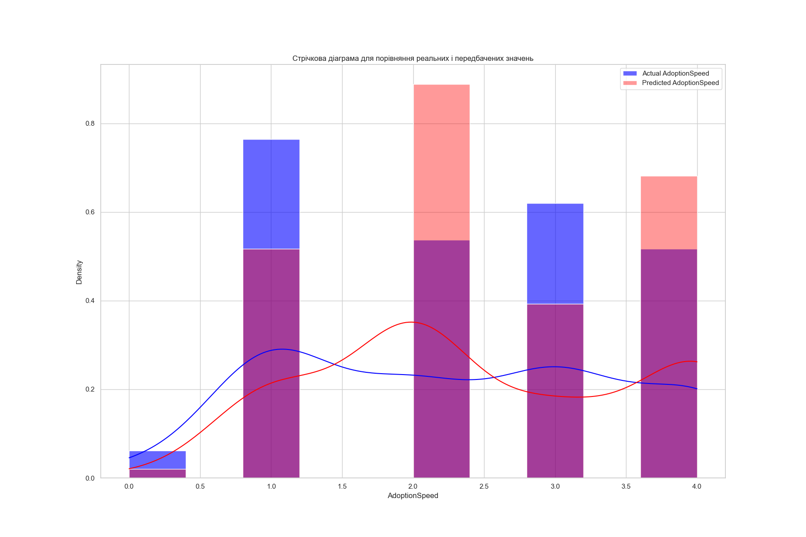
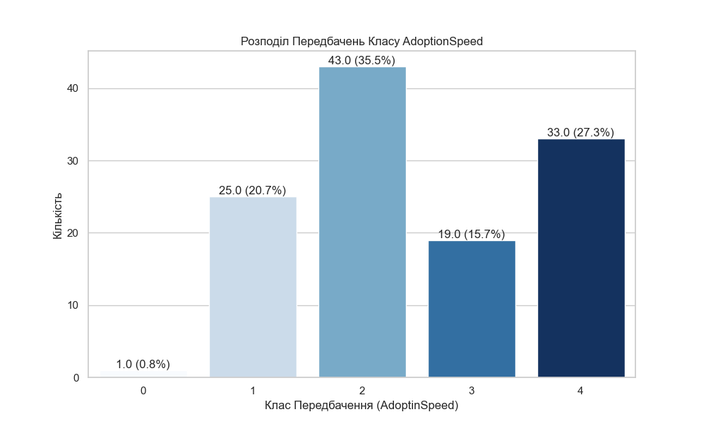
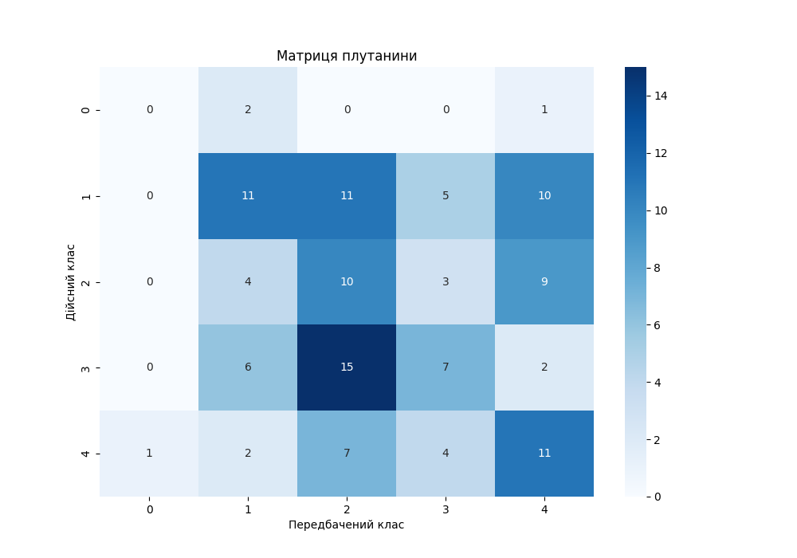

У результаті виконання цієї лабораторної роботи я розробив модель для передбачення швидкості усиновлення тварин (AdoptionSpeed) на основі характеристик тварин, таких як вік, порода, здоров'я тощо. Провів аналіз результатів моделі за допомогою різноманітних візуалізацій:

**Стрічкова діаграма для порівняння реальних і передбачених значень:**

- Ця діаграма дозволяє побачити, як розподіляються реальні значення AdoptionSpeed у порівнянні з передбаченими значеннями моделі.

- Видно, що модель має схильність до зміщення результатів для деяких категорій, і певні класи переважають у передбаченнях. Це може свідчити про перекоси в навчальних даних або недостатню узагальненість моделі.

**Гістограма розподілу передбачених класів `AdoptionSpeed`:**

- На цій гістограмі відображені частоти різних класів, передбачених моделлю. Зокрема, видно, що клас 2 має найбільшу частоту передбачень, а клас 0 — найменшу. Такий дисбаланс може бути ознакою того, що модель не здатна добре передбачати певні класи, можливо через недостатню кількість даних для навчання в цих категоріях.

**Матриця плутанини:**

- Матриця плутанини показує, як часто модель передбачає кожен клас для кожного реального класу. Наприклад, видно, що модель частіше плутає класи 1 та 2, що може бути пов'язано з тим, що ці класи мають схожі характеристики тварин.

- Загалом, кількість правильних передбачень (значення на діагоналі матриці) є доволі низькою, що свідчить про потребу в покращенні якості моделі.

# **Висновки**

Загалом, робота над цим проєктом була дуже корисною для розуміння всіх етапів розробки ML-проєкту, від початкового аналізу даних до розгортання моделі та аналізу її результатів. Це досвід, який допоміг зрозуміти важливість кожного етапу та зв'язок між ними.

Під час роботи над цим проєктом, я помітив кілька цікавих закономірностей, зокрема під час обробки пропущених значень. Наприклад, я звернув увагу, що пропуски часто з'являлися в колонках, пов'язаних із кольором тварин. Відповідно, я використовував різні методи обробки таких пропусків, зокрема використання Forward Fill та Backward Fill, щоб зробити дані більш цілісними.

Також цікавою частиною було вибирати між різними моделями машинного навчання з урахуванням бізнес-потреб компанії. Для цього я порівнював моделі, використовуючи метрики, такі як точність, повнота, F1-міра та інші, щоб знайти найкращу модель для конкретного завдання. Мені потрібно було враховувати, що для бізнесу важливі не тільки абсолютні показники якості, а й те, як модель допоможе у досягненні бізнес-цілей, наприклад, у збільшенні ймовірності усиновлення тварин у притулку. У цьому процесі я зрозумів, що іноді модель із трохи меншою точністю може бути кращою, якщо вона враховує важливіші характеристики для бізнесу.

Особливо важливою частиною для мене було балансування класів, оскільки моя цільова змінна `AdoptionSpeed` мала аж 5 класів, і кожен з них був представлений нерівномірно. Я використовував різні методи для того, щоб вирівняти класи і зменшити вплив дисбалансу на якість моделі. Це дало змогу значно покращити роботу моделі, особливо для класів, які були недостатньо представлені. Балансування класів було дуже корисним етапом для отримання більш адекватних результатів у реальних умовах.

Ці етапи дали мені можливість краще зрозуміти, як працювати з реальними даними та адаптувати моделі до специфічних потреб. Це було складно, але разом із тим надзвичайно корисно та цікаво, оскільки я навчився ефективно вирішувати проблеми, пов'язані з підготовкою даних і вибором моделей для розв'язання конкретних бізнесових завдань.
